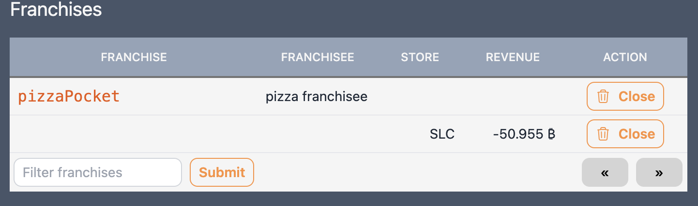
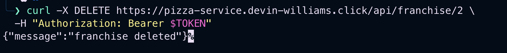
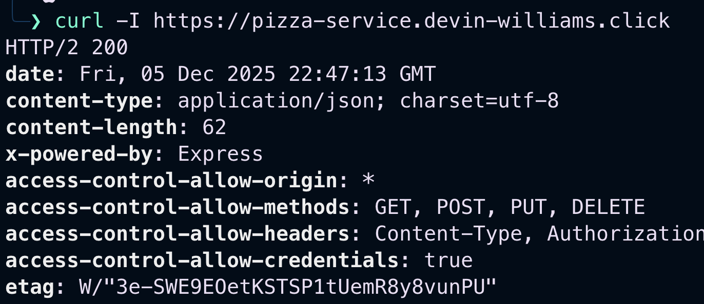

### Merica attack record

| Item           | Result                                                                                  |
| -------------- | --------------------------------------------------------------------------------------- |
| Date           | December 4, 2025                                                                        |
| Target         | pizza.merica.click                                                                      |
| Classification | Server side request forgery                                                             |
| Severity       | 3                                                                                       |
| Description    | Ordered pizza for -100 Bitcoin, store now says its in debt. Using a simple curl request |
| Images         | PHOTO HERE!!                                                                            |
| Corrections    | Verify who order request and dont allow different prices to be used                     |

## Devin Personal Testing

| Item           | Result                                                                                  |
| -------------- | --------------------------------------------------------------------------------------- |
| Date           | December 4, 2025                                                                        |
| Target         | pizza.devin-williams.click                                                              |
| Classification | Server side request forgery                                                             |
| Severity       | 3                                                                                       |
| Description    | Ordered pizza for -100 Bitcoin, store now says its in debt. Using a simple curl request |
| Images         |                                       |
| Corrections    | Verify who order request and dont allow different prices to be used                     |

| Item           | Result                                                          |
| -------------- | --------------------------------------------------------------- |
| Date           | December 5, 2025                                                |
| Target         | pizza.devin-williams.click                                      |
| Classification | Security Misconfiguration                                       |
| Severity       | 2                                                               |
| Description    | Using defualt account credentials for a@jwt.com, d@jwt.com, etc |
| Images         |                           |
| Corrections    | update login credentials                                        |

| Item           | Result                                               |
| -------------- | ---------------------------------------------------- |
| Date           | December 5, 2025                                     |
| Target         | pizza.devin-williams.click                           |
| Classification | Broken Access Control                                |
| Severity       | 1                                                    |
| Description    | deleted a franchise as a regular user                |
| Images         |      |
| Corrections    | Have better auth in place for administrative actions |

| Item           | Result                                               |
| -------------- | ---------------------------------------------------- |
| Date           | December 5, 2025                                     |
| Target         | pizza.devin-williams.click                           |
| Classification | Information Disclosure                               |
| Severity       | 3                                                    |
| Description    | Shows internal file paths - showing stack trace      |
| Images         |        |
| Corrections    | Dont report full stack trace and file path in errors |

| Item           | Result                                                                                                                                               |
| -------------- | ---------------------------------------------------------------------------------------------------------------------------------------------------- |
| Date           | December 5, 2025                                                                                                                                     |
| Target         | pizza.devin-williams.click                                                                                                                           |
| Classification | Missing Security Headers                                                                                                                             |
| Severity       | 4                                                                                                                                                    |
| Description    | No security headers and exposes tech stack `express`                                                                                                 |
| Images         |                                                                                      |
| Corrections    | Add security headers for better security i.e. `Content-Security-Policy`, `X-Frame-Options`, `Strict-Transport-Security`, and dont expose tech stack. |

### Learnings

- **Server-side validation is critical** - Never trust client input. Validate all data server-side (prices, quantities, permissions).
- **Authorization ≠ Authentication** - Knowing who the user is doesn't mean they should access everything. Check permissions for every action.
- **Verbose errors expose attack vectors** - Stack traces reveal internal paths and structure. Use generic error messages in production.
- **Security headers provide defense in depth** - CSP, X-Frame-Options, and HSTS are simple additions that significantly improve security posture.
- **Business logic flaws are hard to detect** - Automated scanners miss issues like negative prices. Manual testing and code review are essential.
- **Think like an attacker** - Test unexpected inputs (negative numbers, SQL syntax, unauthorized actions) on every endpoint.
- **Fix the basics first** - Simple exploits (default credentials, missing validation, broken access control) are often the most damaging.
