## Self Attack: Merica

| Item           | Result                                                                     |
| -------------- | -------------------------------------------------------------------------- |
| Date           | December 3, 2025                                                           |
| Target         | pizza.merica.click                                                         |
| Classification | Security Misconfiguration                                                  |
| Severity       | 2                                                                          |
| Description    | Logged in as admin (default password), franchisee, and default diner user. |
| Images         | 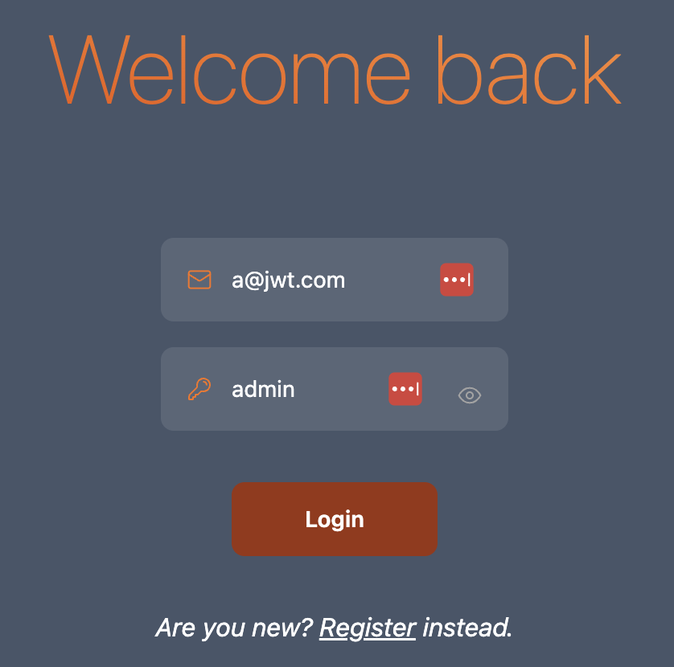                       |
| Corrections    | Change default passwords.                                                  |

| Item           | Result                                                                                                                                      |
| -------------- | ------------------------------------------------------------------------------------------------------------------------------------------- |
| Date           | December 3, 2025                                                                                                                            |
| Target         | pizza.merica.click                                                                                                                          |
| Classification | Insecure Design                                                                                                                             |
| Severity       | 2                                                                                                                                           |
| Description    | Can create multiple users with the same username. Even after being created, only the first user with that username can log in successfully. |
| Images         | 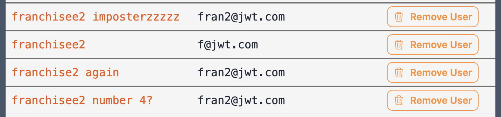                                                                                          |
| Corrections    | Add check to make sure that email is not already in use. If it is, require the user to enter a different email.                             |

| Item           | Result                                                                                                                                                                                                                                             |
| -------------- | -------------------------------------------------------------------------------------------------------------------------------------------------------------------------------------------------------------------------------------------------- |
| Date           | December 3, 2025                                                                                                                                                                                                                                   |
| Target         | pizza.merica.click                                                                                                                                                                                                                                 |
| Classification | Injection                                                                                                                                                                                                                                          |
| Severity       | 1                                                                                                                                                                                                                                                  |
| Description    | Changed all usernames and passwords via SQL injection. This **really** messed up my database and made it so that no users could log in.                                                                                                            |
| Images         | 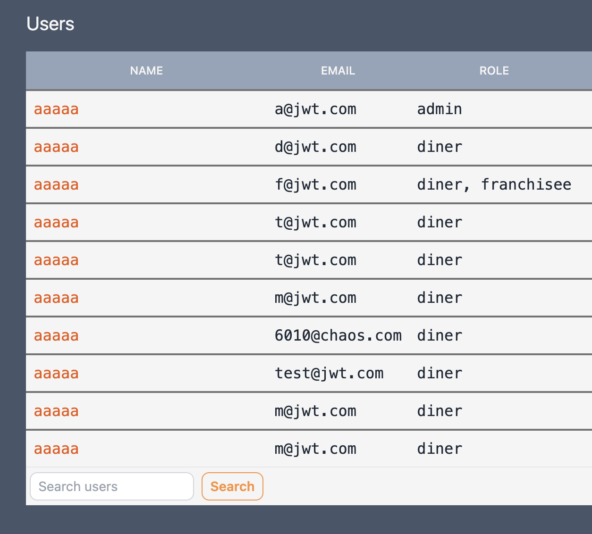                                                                                                                                                                                                 |
| Corrections    | First, fix the database by reverting to a previous point in time in the database. Then, change updateUser to use parameterized SQL input. Also made sure all other database calls used parameterized input to prevent other SQL injection attacks. |

| Item           | Result                                                                                                                                    |
| -------------- | ----------------------------------------------------------------------------------------------------------------------------------------- |
| Date           | December 3, 2025                                                                                                                          |
| Target         | pizza.merica.click                                                                                                                        |
| Classification | Broken Access Control                                                                                                                     |
| Severity       | 4                                                                                                                                         |
| Description    | Anyone can access the create franchise and create store screens (although they don't appear to be able to create a store or a franchise). |
| Images         | 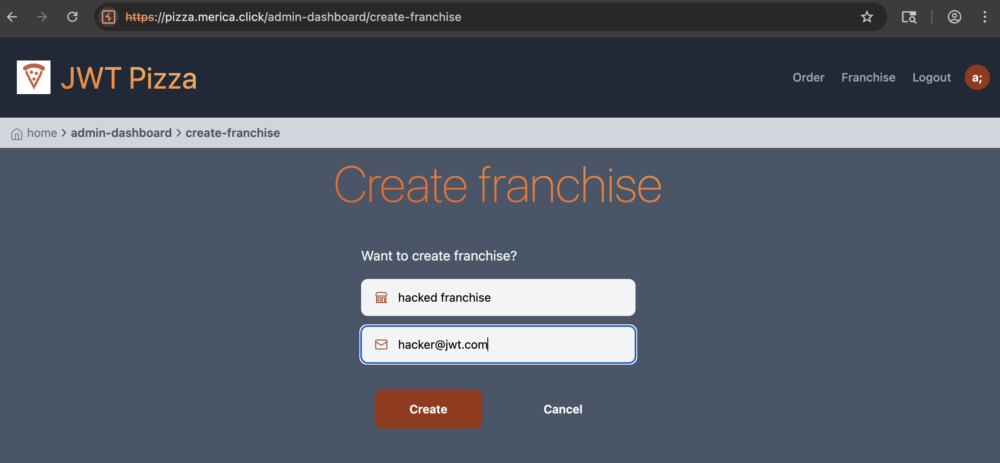 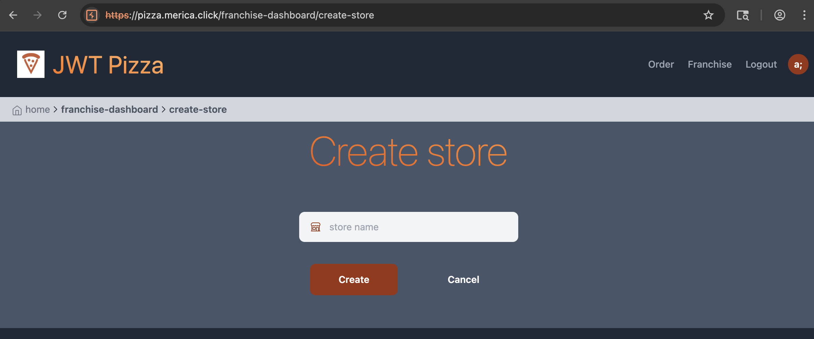                                                  |
| Corrections    | Reconfigure app setup to only allow authorized users to view these pages.                                                                 |

| Item           | Result                                                                                                            |
| -------------- | ----------------------------------------------------------------------------------------------------------------- |
| Date           | December 4, 2025                                                                                                  |
| Target         | pizza.merica.click                                                                                                |
| Classification | Identification and Authentication Failures                                                                        |
| Severity       | 3                                                                                                                 |
| Description    | Users can execute brute force attacks by attempting to log in with different passwords repeatedly, without limit. |
| Images         | 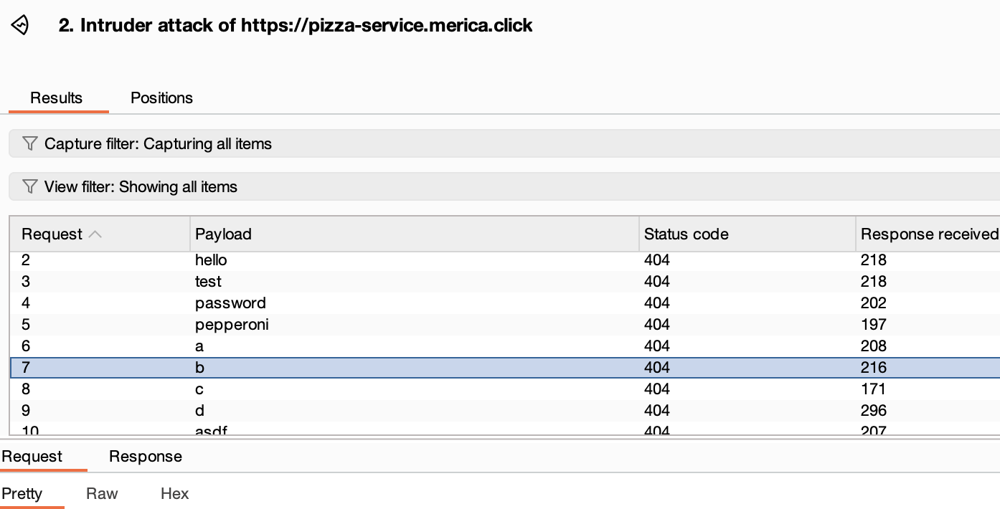 After fix: 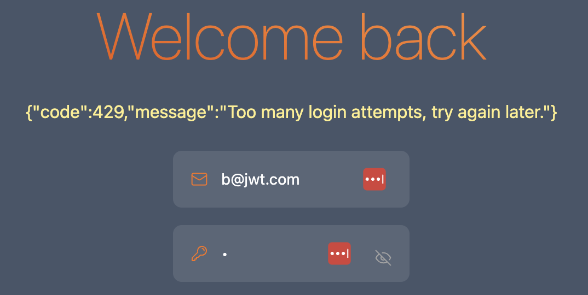                        |
| Corrections    | Add rate limiters to login and register so that only 5 attempts may be made per minute.                           |

| Item           | Result                                                                                                                                                                |
| -------------- | --------------------------------------------------------------------------------------------------------------------------------------------------------------------- |
| Date           | December 4, 2025                                                                                                                                                      |
| Target         | pizza.merica.click                                                                                                                                                    |
| Classification | Broken Access Control                                                                                                                                                 |
| Severity       | 2                                                                                                                                                                     |
| Description    | Anyone can access the delete franchise endpoint.                                                                                                                      |
| Images         | Before: 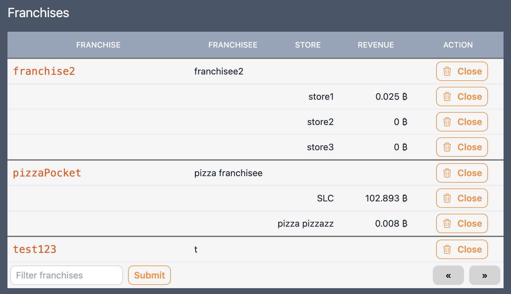 Deletion: 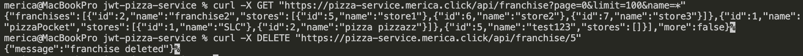 After: 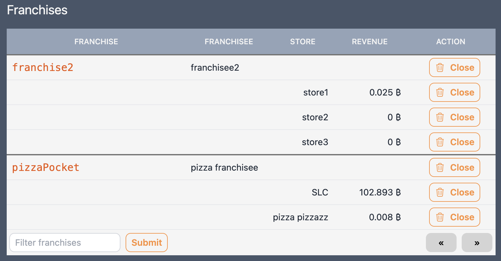 |
| Corrections    | Fix endpoint so that only authorized admins can delete franchises.                                                                                                    |

| Item           | Result                                                                   |
| -------------- | ------------------------------------------------------------------------ |
| Date           | December 4, 2025                                                         |
| Target         | pizza.merica.click                                                       |
| Classification | Injection                                                                |
| Severity       | 1 (depending on the injection)                                           |
| Description    | User could potentially add different parameters into pagination queries. |
| Images         | (With corrections here) 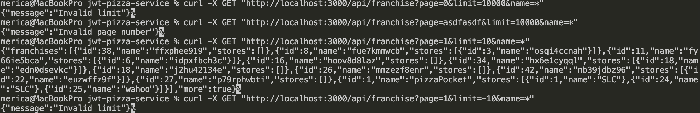        |
| Corrections    | Add verification that page and limit are valid integers.                 |

## Self Attack: Devin

| Item           | Result                                                                                  |
| -------------- | --------------------------------------------------------------------------------------- |
| Date           | December 4, 2025                                                                        |
| Target         | pizza.devin-williams.click                                                              |
| Classification | Server side request forgery                                                             |
| Severity       | 3                                                                                       |
| Description    | Ordered pizza for -100 Bitcoin, store now says its in debt. Using a simple curl request |
| Images         |                                       |
| Corrections    | Verify who order request and dont allow different prices to be used                     |

| Item           | Result                                                          |
| -------------- | --------------------------------------------------------------- |
| Date           | December 5, 2025                                                |
| Target         | pizza.devin-williams.click                                      |
| Classification | Security Misconfiguration                                       |
| Severity       | 2                                                               |
| Description    | Using defualt account credentials for a@jwt.com, d@jwt.com, etc |
| Images         |                           |
| Corrections    | update login credentials                                        |

| Item           | Result                                               |
| -------------- | ---------------------------------------------------- |
| Date           | December 5, 2025                                     |
| Target         | pizza.devin-williams.click                           |
| Classification | Broken Access Control                                |
| Severity       | 1                                                    |
| Description    | deleted a franchise as a regular user                |
| Images         |      |
| Corrections    | Have better auth in place for administrative actions |

| Item           | Result                                               |
| -------------- | ---------------------------------------------------- |
| Date           | December 5, 2025                                     |
| Target         | pizza.devin-williams.click                           |
| Classification | Information Disclosure                               |
| Severity       | 3                                                    |
| Description    | Shows internal file paths - showing stack trace      |
| Images         | 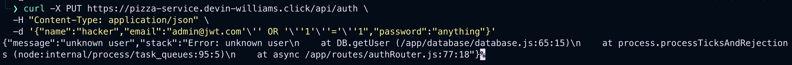       |
| Corrections    | Dont report full stack trace and file path in errors |

| Item           | Result                                                                                                                                               |
| -------------- | ---------------------------------------------------------------------------------------------------------------------------------------------------- |
| Date           | December 5, 2025                                                                                                                                     |
| Target         | pizza.devin-williams.click                                                                                                                           |
| Classification | Missing Security Headers                                                                                                                             |
| Severity       | 4                                                                                                                                                    |
| Description    | No security headers and exposes tech stack `express`                                                                                                 |
| Images         |                                                                                      |
| Corrections    | Add security headers for better security i.e. `Content-Security-Policy`, `X-Frame-Options`, `Strict-Transport-Security`, and dont expose tech stack. |

## Peer Attack: Merica

| Item           | Result                                                                           |
| -------------- | -------------------------------------------------------------------------------- |
| Date           | December 4, 2025                                                                 |
| Target         | pizza.devin-williams.click                                                       |
| Classification | Security Misconfiguration                                                        |
| Severity       | 2                                                                                |
| Description    | Logged in as admin (default password), franchisee, default diner, and test user. |
| Images         | 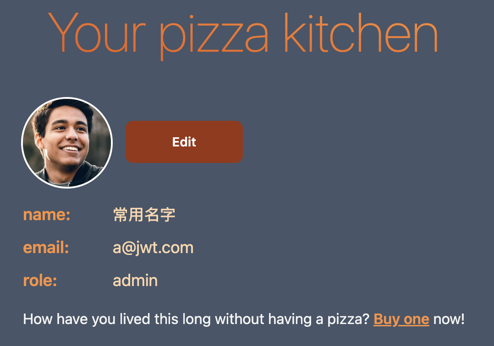                                                |
| Corrections    | Change passwords for default users.                                              |

| Item           | Result                                                                                                                                                                   |
| -------------- | ------------------------------------------------------------------------------------------------------------------------------------------------------------------------ |
| Date           | December 4, 2025                                                                                                                                                         |
| Target         | pizza.devin-williams.click                                                                                                                                               |
| Classification | Insecure Design                                                                                                                                                          |
| Severity       | 2                                                                                                                                                                        |
| Description    | Multiple users can be created with the same email. After logging out, only the original user can still log in with that email. Other users with that email can't log in. |
| Images         | 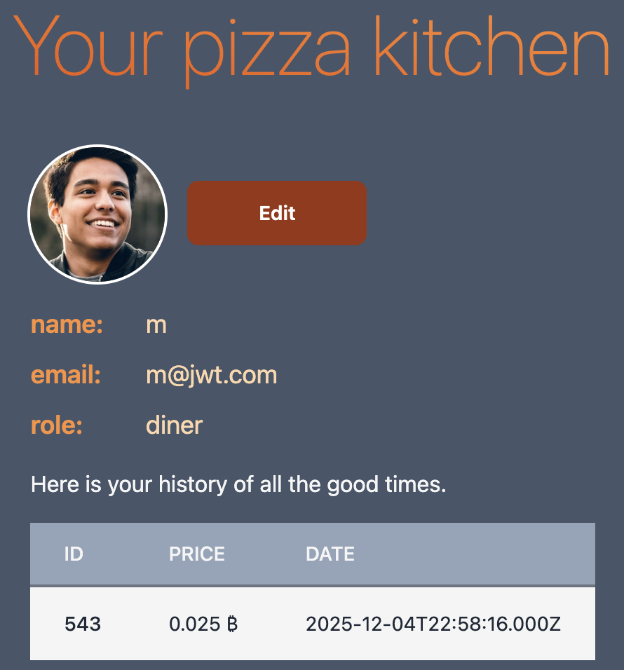 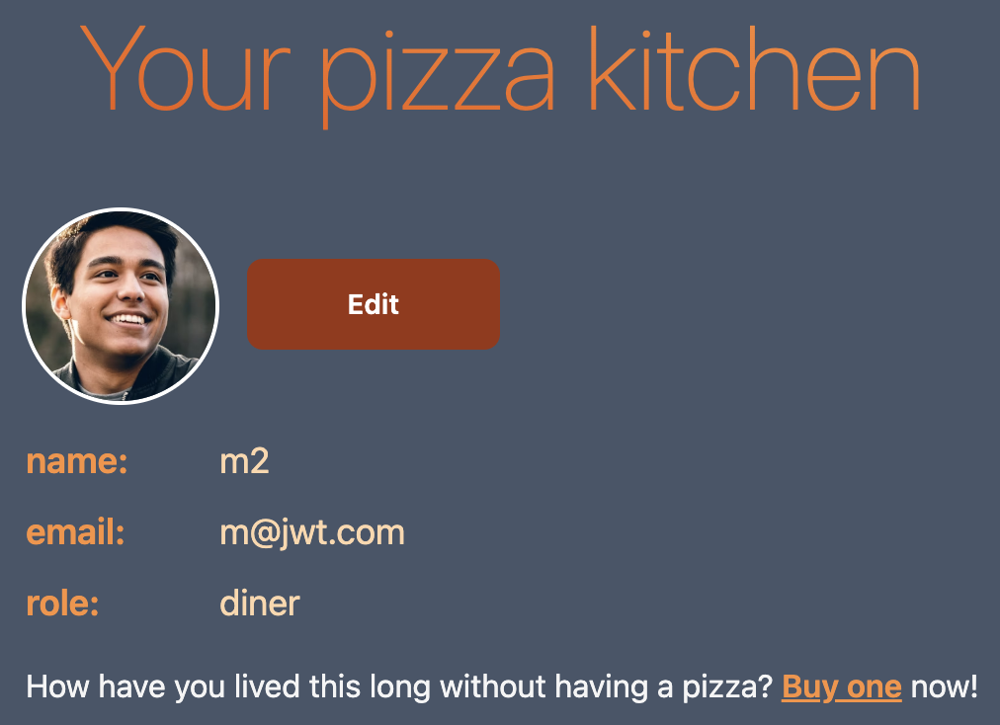                                                                                                 |
| Corrections    | Verify emails so that emails can only be used once to log in.                                                                                                            |

| Item           | Result                                                                                                                                                                                                                                                                                                  |
| -------------- | ------------------------------------------------------------------------------------------------------------------------------------------------------------------------------------------------------------------------------------------------------------------------------------------------------- |
| Date           | December 4, 2025                                                                                                                                                                                                                                                                                        |
| Target         | pizza.devin-williams.click                                                                                                                                                                                                                                                                              |
| Classification | Broken Access Control                                                                                                                                                                                                                                                                                   |
| Severity       | 4                                                                                                                                                                                                                                                                                                       |
| Description    | Anyone (logged in or not) can look at the create franchise and create store pages on the admin dashboard and the create store page on the franchise dashboard. However, creating a franchise or store doesn't appear to actually work; the person can just see the page when they shouldn't be able to. |
| Images         | 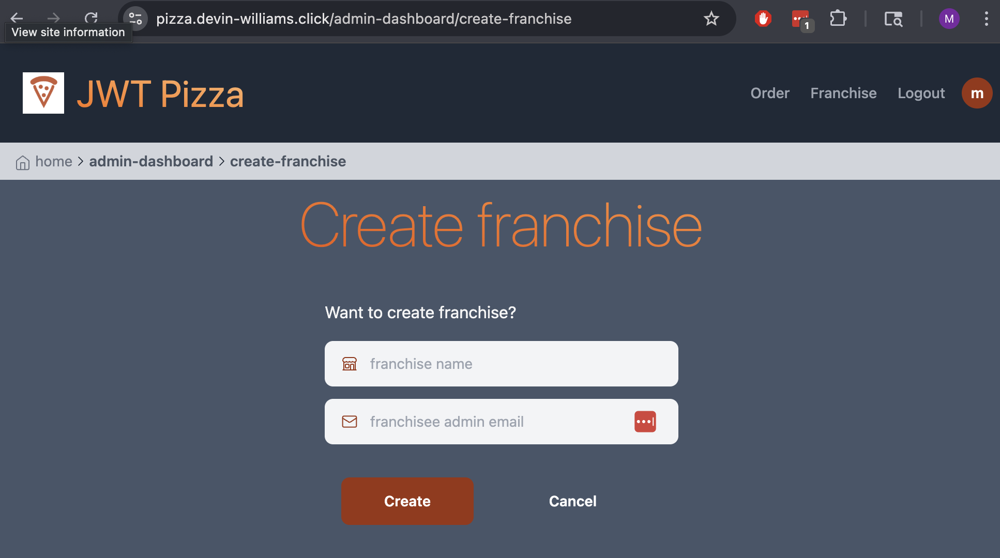 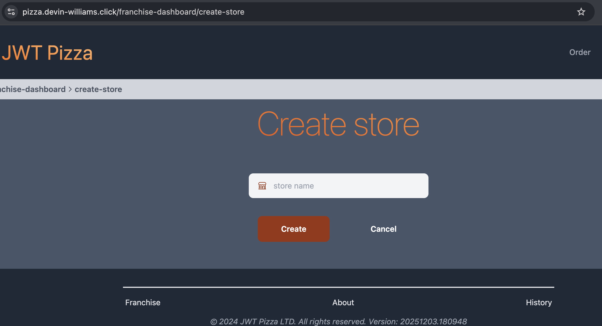                                                                                                                                                                                                                  |
| Corrections    | Fix who can see the franchise and store creation pages (only an admin should see the franchise creation page and only admins and franchisees should be able to see the store creation page).                                                                                                            |

| Item           | Result                                                                                           |
| -------------- | ------------------------------------------------------------------------------------------------ |
| Date           | December 4, 2025                                                                                 |
| Target         | pizza.devin-williams.click                                                                       |
| Classification | Security Misconfiguration                                                                        |
| Severity       | 4                                                                                                |
| Description    | Errors print out stack trace (which I've been told is bad practice).                             |
| Images         | 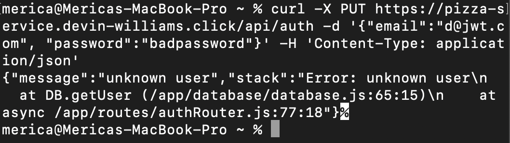                                                                |
| Corrections    | Make sure sensitive information (such as stack traces) aren't accessible by unauthorized people. |

| Item           | Result                                                                              |
| -------------- | ----------------------------------------------------------------------------------- |
| Date           | December 4, 2025                                                                    |
| Target         | pizza.devin-williams.click                                                          |
| Classification | Identification and Authentication Failures                                          |
| Severity       | 3                                                                                   |
| Description    | Attackers could launch a brute force attack. There are no limits on login attempts. |
| Images         | 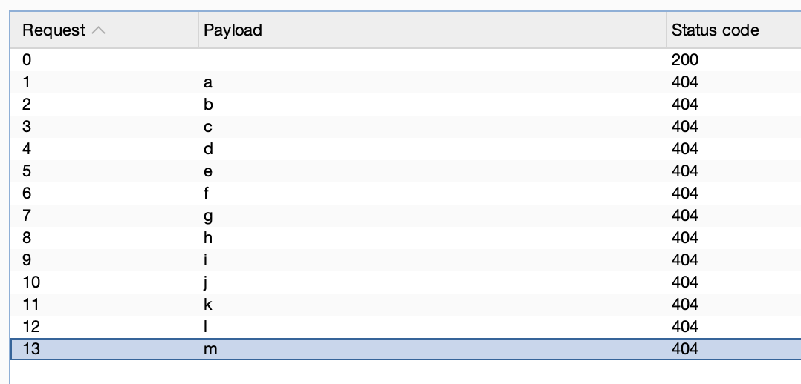                                                   |
| Corrections    | Throttle login attempts to make it difficult to launch brute force attacks.         |

| Item           | Result                                                                                          |
| -------------- | ----------------------------------------------------------------------------------------------- |
| Date           | December 4, 2025                                                                                |
| Target         | pizza.devin-williams.click                                                                      |
| Classification | Broken Access Control                                                                           |
| Severity       | 2 (doesn't bring the whole site down, but still causes major issues)                            |
| Description    | Anyone can delete franchises without being logged in as long as they have the franchise number. |
| Images         | 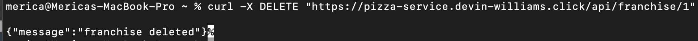 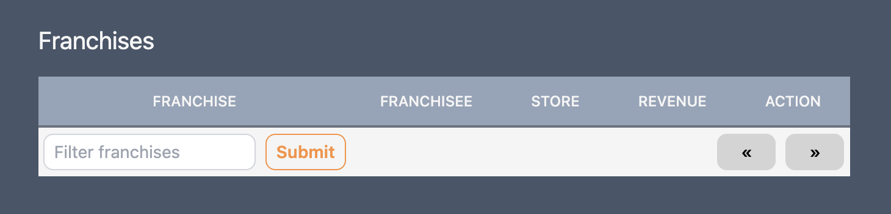         |
| Corrections    | Protect the delete franchise endpoint with appropriate authorization checks.                    |

| Item           | Result                                                                                                                                  |
| -------------- | --------------------------------------------------------------------------------------------------------------------------------------- |
| Date           | December 6, 2025                                                                                                                        |
| Target         | pizza.devin-williams.click                                                                                                              |
| Classification | Injection                                                                                                                               |
| Severity       | 1                                                                                                                                       |
| Description    | Injected SQL code into the update user name box and changed all user's names and passwords, which makes it so that no users can log in. |
| Images         | 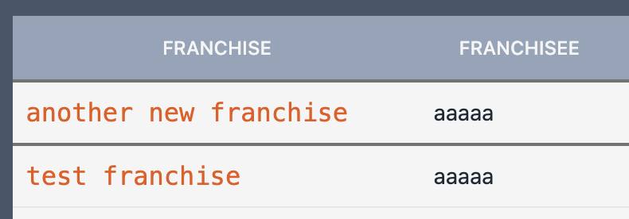 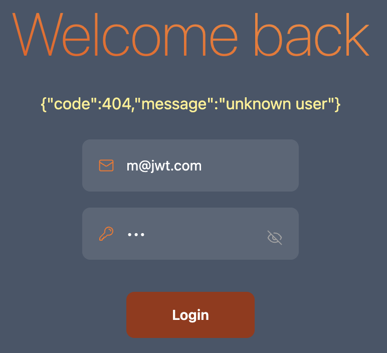 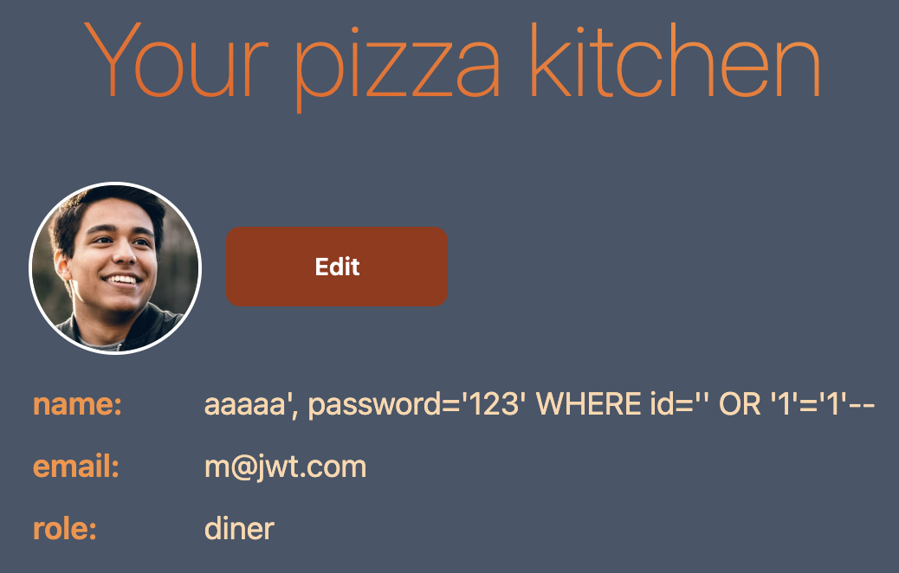                          |
| Corrections    | Sanitize user input and use SQL parameterization to prevent SQL injection attacks.                                                      |

## Peer Attack: Devin

| Item           | Result                                                                                  |
| -------------- | --------------------------------------------------------------------------------------- |
| Date           | December 4, 2025                                                                        |
| Target         | pizza.merica.click                                                                      |
| Classification | Server side request forgery                                                             |
| Severity       | 3                                                                                       |
| Description    | Ordered pizza for -100 Bitcoin, store now says its in debt. Using a simple curl request |
| Images         | 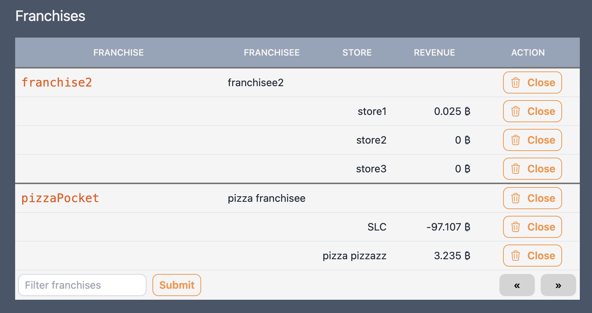                                                   |
| Corrections    | Verify who order request and dont allow different prices to be used                     |

| Item           | Result                                                                 |
| -------------- | ---------------------------------------------------------------------- |
| Date           | December 5, 2025                                                       |
| Target         | pizza.merica.click                                                     |
| Classification | Security Misconfiguration                                              |
| Severity       | 0                                                                      |
| Description    | Blocks using defualt account credentials for a@jwt.com, d@jwt.com, etc |
| Images         | 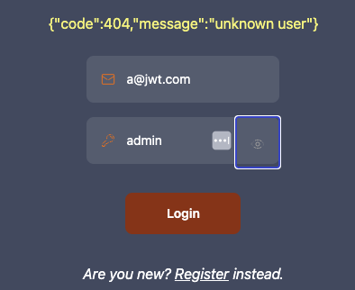                    |
| Corrections    | N/A                                                                    |

| Item           | Result                                                    |
| -------------- | --------------------------------------------------------- |
| Date           | December 5, 2025                                          |
| Target         | pizza.merica.click                                        |
| Classification | Broken Access Control                                     |
| Severity       | 0                                                         |
| Description    | Blocks deleted a franchise as a regular user              |
| Images         | 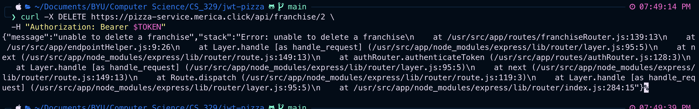 |
| Corrections    | N/A                                                       |

## Learnings

- **Server-side validation is critical** - Never trust client input. Validate all data server-side (prices, quantities, permissions).
- **Authorization ≠ Authentication** - Knowing who the user is doesn't mean they should access everything. Check permissions for every action.
- **Verbose errors expose attack vectors** - Stack traces reveal internal paths and structure. Use generic error messages in production.
- **Security headers provide defense in depth** - CSP, X-Frame-Options, and HSTS are simple additions that significantly improve security posture.
- **Business logic flaws are hard to detect** - Automated scanners miss issues like negative prices. Manual testing and code review are essential.
- **Think like an attacker** - Test unexpected inputs (negative numbers, SQL syntax, unauthorized actions) on every endpoint.
- **Fix the basics first** - Simple exploits (default credentials, missing validation, broken access control) are often the most damaging.
